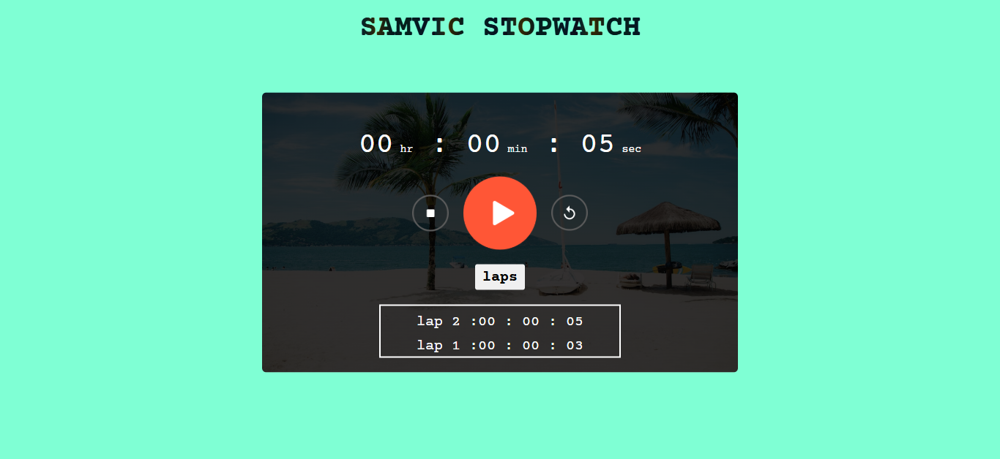

# STOPWATCH APP 

## 🌟 About the Project  

⏱️ Stopwatch App

The Stopwatch App is a simple yet powerful web-based tool that allows users to track elapsed time with precision. It includes essential stopwatch functionalities like start, pause, reset, and lap time tracking, making it useful for various timing needs.

✨ Features
Start, pause, and reset functionality
Displays elapsed time in hours, minutes, seconds, and milliseconds
Lap time tracking for multiple intervals
Responsive and user-friendly interface

🚀 Technologies Used
HTML
CSS
JavaScript

🔧 How It Works
Click the Start button to begin timing.
Click Pause to temporarily stop the timer.
Click Reset to clear the timer and start over.

## 🚀 Live Demo  
🔗 [Visit the Website](https://e-cormmerce-store-for-electronics.vercel.app/)
